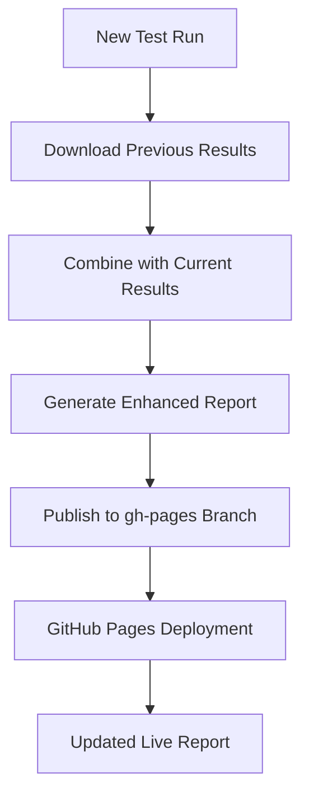

# GitHub Pages Integration for Allure Reports

This guide explains how to set up automatic publishing of Allure reports to GitHub Pages, as documented in the [Allure GitHub Actions integration guide](https://allurereport.org/docs/integrations-github/).

## 🌟 Benefits of GitHub Pages Integration

### **Persistent Reports**
- Reports remain accessible indefinitely 
- No need to download artifacts from GitHub Actions
- Direct links to share with team members

### **Historical Data**
- Automatic test trend analysis across runs
- Flaky test identification over time
- Performance regression tracking

### **Professional Presentation**
- Clean, bookmarkable URLs
- No authentication required for viewing
- Perfect for stakeholder reviews

## 🔧 Setup Instructions

### 1. Enable Write Permissions for GitHub Actions

**This is crucial** - without this, the workflow cannot publish to GitHub Pages.

1. Go to your repository on GitHub
2. Navigate to **Settings → Actions → General**
3. Under **Workflow permissions**, select **"Read and write permissions"**
4. Click **Save**


### 2. Configure GitHub Pages

After running the workflow once to create the `gh-pages` branch:

1. Go to **Settings → Pages** in your repository
2. Under **Build and deployment**:
   - **Source**: "Deploy from a branch"
   - **Branch**: `gh-pages`
   - **Folder**: `/ (root)`
3. Click **Save**

### 3. Run Your First Workflow

The new workflows are configured to:
- **Artifact Mode**: For pull requests and feature branches
- **GitHub Pages Mode**: For main branch and manual triggers

#### Manual Trigger with Pages Publishing
```bash
# Trigger via GitHub UI:
# Actions → "E2E Tests with Allure Reports" → "Run workflow"
# Check "Publish reports to GitHub Pages"
```

#### Automatic Publishing
- **Main branch pushes**: Automatically publish to Pages
- **Other branches**: Upload as artifacts only

## 📁 New Workflow Files

### `allure-report-publish.yml`
Reusable workflow that supports both modes:
- **Artifact upload** (existing behavior)
- **GitHub Pages publishing** (new feature)

### `e2e-tests-with-allure.yml`
Example workflow showing:
- Individual app testing with Allure
- Combined report generation
- Smart publishing logic

## 🚀 How It Works

### Historical Data Flow


### Report URL Structure
```
https://YOUR_USERNAME.github.io/civic-auth-examples/
├── index.html (latest combined report)
├── history/ (trend data)
└── data/ (test execution details)
```

## 📊 What You Get

### **Combined Dashboard**
- All test results in one unified report
- Cross-browser comparison views
- Suite-level aggregation

### **Rich Historical Analysis**
- Test stability trends over weeks/months
- Performance regression detection
- Success rate analytics

### **Professional Sharing**
- Clean URLs for stakeholder sharing
- No GitHub authentication required
- Mobile-friendly responsive design

## 🔄 Migration from Artifacts

Your existing workflows will continue to work unchanged. The new GitHub Pages integration is **additive**:

### Current Behavior (Preserved)
```yaml
# Still uploads artifacts for all runs
- name: Upload Allure Results
  uses: actions/upload-artifact@v4
  with:
    name: allure-results-*
    path: packages/e2e/allure-results/
```

### New GitHub Pages Option
```yaml
# Only publishes to Pages when configured
- name: Publish test report to GitHub Pages
  if: ${{ inputs.publish-to-pages }}
  uses: peaceiris/actions-gh-pages@v3
```

## 🎯 Best Practices

### **Branch Strategy**
- **Feature branches**: Artifact uploads only
- **Main/develop**: GitHub Pages publishing
- **Manual triggers**: User choice via workflow_dispatch

### **Performance Optimization**
- Reports auto-clean after 30 days of history
- Large attachments are compressed automatically
- Only essential data preserved in trends

### **Security Considerations**
- Reports are publicly accessible (no auth required)
- Sensitive data should not be included in test results
- Use environment variables for secrets, not hardcoded values

## 🐛 Troubleshooting

### Permission Errors
```
remote: Permission to USER/REPOSITORY.git denied to github-actions[bot]
```
**Solution**: Enable write permissions (Step 1 above)

### Pages Not Updating
1. Check that `gh-pages` branch exists
2. Verify Pages configuration points to `gh-pages` branch
3. Look for "pages build and deployment" workflow runs

### Missing Historical Data
- First run won't have history (expected)
- History builds up over multiple runs
- Check that `gh-pages` branch contains previous data

### Report Generation Failures
```yaml
# Add debugging to workflow
- name: Debug Allure Results
  run: |
    ls -la packages/e2e/allure-results/
    find . -name "*.json" | head -5
```

## 📈 Advanced Features

### Custom Report Titles
```yaml
# In workflow configuration
env:
  ALLURE_REPORT_TITLE: "Civic Auth E2E Tests"
  ALLURE_REPORT_NAME: "Production Test Suite"
```

### Multiple Report Pages
You can create separate reports for different test suites:
- `/main-suite/` - Core functionality tests
- `/regression/` - Full regression suite  
- `/performance/` - Performance benchmarks

### Integration with PR Comments
```yaml
# Add this step to comment on PRs with report links
- name: Comment PR with report link
  if: github.event_name == 'pull_request'
  uses: actions/github-script@v6
  with:
    script: |
      github.rest.issues.createComment({
        issue_number: context.issue.number,
        owner: context.repo.owner,
        repo: context.repo.repo,
        body: '📊 [View Allure Report](https://YOUR_USERNAME.github.io/civic-auth-examples/)'
      })
```

## 🔗 Useful Links

- [Allure GitHub Actions Integration](https://allurereport.org/docs/integrations-github/)
- [GitHub Pages Documentation](https://docs.github.com/en/pages)
- [Allure Report Features](https://allurereport.org/docs/features/)
- [Simple Allure Report Action](https://github.com/simple-elf/allure-report-action)
