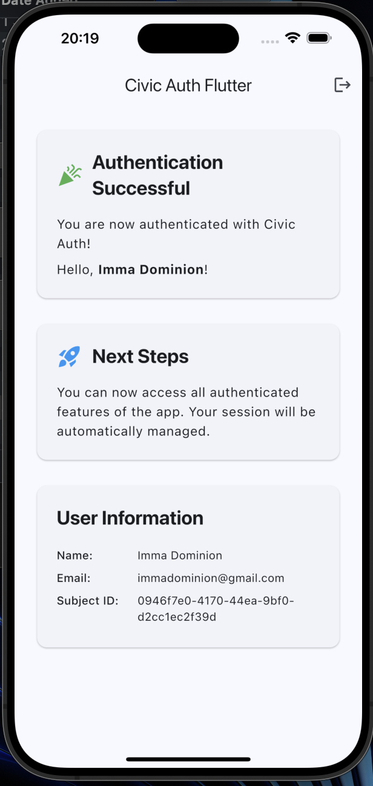
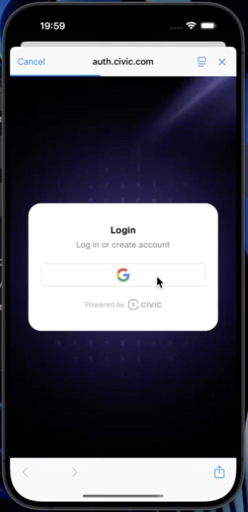

# Civic Auth Flutter Example

A Flutter app demonstrating OAuth2/OIDC authentication using Civic Auth for mobile environments. This example shows how to integrate Civic Auth in a Flutter app with a simple, modern UI.

## Quick Start

1. **Install dependencies**
   ```bash
   flutter pub get
   ```

2. **Create a Civic Auth account**
   - Sign up at [auth.civic.com](https://auth.civic.com) and get your client ID.
   - Add the application domain as `com.civicauth.flutter://` under the Domains menu. This allows the app to redirect back after authentication.

3. **Configure your app**
   - Update your `android/app/src/main/AndroidManifest.xml` and `ios/Runner/Info.plist` for deep linking (see code for details).
   - Set your Civic Auth client ID in the app's configuration.

4. **Run the app**
   ```bash
   flutter run
   ```

## App Architecture

- **HomeScreen**: Shows sign-in or authenticated content.
- **AuthGuard**: Widget to protect routes that require authentication.
- **AuthProvider**: Centralized authentication state management.

## File Structure

```
lib/
  ├── main.dart                # Entry point
  ├── screens/
  │     └── home_screen.dart   # Main screen with AuthGuard
  ├── providers/
  │     └── auth_provider.dart # Auth state management
  └── widgets/
        └── auth_guard.dart    # Auth wrapper
```

## Screenshots

<p align="center">
  
  
</p>

## Development

- Supports hot reload with `flutter run`.
- Test on Android emulator or iOS simulator.
- Uses Provider for state management.

## Disclaimer

This project is a minimal example of Civic Auth integration in Flutter. For production, consider:
- Secure token storage (e.g., flutter_secure_storage)
- Refresh token handling
- Error handling and user feedback

